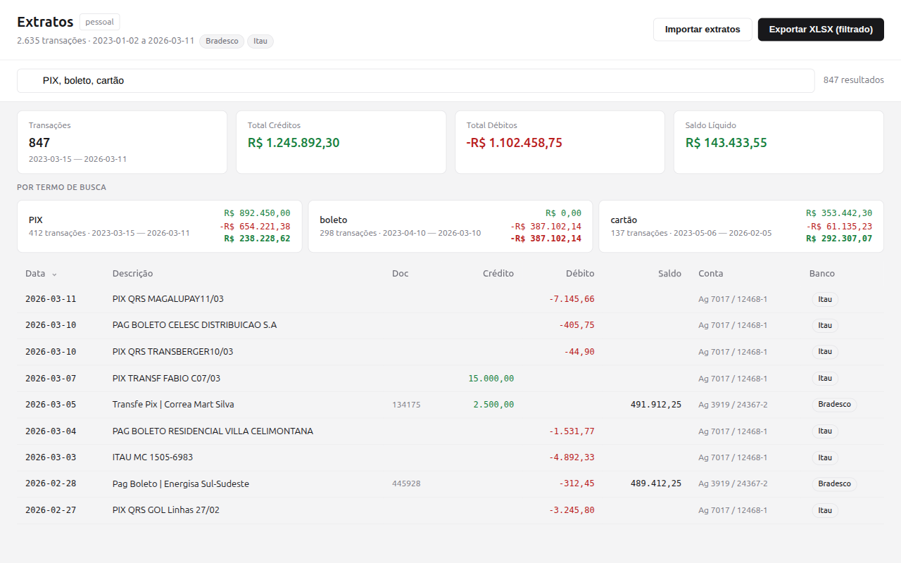

<p align="center">
  
</p>

<p align="center">
  Desktop app for importing, searching, and analyzing Brazilian bank statements.
</p>

<p align="center">
  <a href="https://canesin.github.io/extratos/">Website</a> ·
  <a href="https://github.com/canesin/extratos/releases/latest">Latest Release</a>
</p>

Built with [Wails v3](https://wails.io/) (Go + React/TypeScript + shadcn/ui).



## Features

- **Multi-bank support** — Bradesco (CSV), Itaú (XLS), Nubank (CSV), and OFX (Banco do Brasil, Caixa, Santander, Inter, etc.) with auto-detection
- **Full-text search** — FTS5 trigram tokenizer for substring and accent-insensitive matching
- **Multi-term OR search** — comma-separated queries with per-clause summaries
- **Smart deduplication** — re-import the same file without creating duplicates
- **Internal transfer filtering** — investment applications/redemptions excluded from aggregate totals
- **XLSX export** — styled Excel export with autofilter, frozen header, and SUM formulas
- **Multiple databases** — create, rename, delete separate databases for different accounts/entities
- **Import preview** — review transactions before committing to the database
- **Sortable columns** — click column headers to sort by any field
- **CLI mode** — headless import, export, search, and stats via `extratos-app cli`

## Supported Banks

| Bank             | Format | Encoding      | Notes                                  |
|------------------|--------|---------------|----------------------------------------|
| Bradesco         | CSV    | ISO-8859-1    | Semicolon-separated, DD/MM/YY dates    |
| Itaú             | XLS    | BIFF (binary) | Exported from internet banking         |
| Banco do Brasil  | OFX    | SGML          | Standard OFX/SGML export               |
| Caixa Econômica  | OFX    | SGML          | Standard OFX/SGML export               |
| Santander        | OFX    | SGML          | Standard OFX/SGML export               |
| Inter            | OFX    | SGML          | Standard OFX/SGML export               |
| Nubank           | CSV    | UTF-8         | Comma-separated, YYYY-MM-DD dates      |
| Any bank         | OFX    | SGML          | Generic OFX/SGML support               |

## Build

### Prerequisites

- Go 1.23+
- Node.js 22+
- [Wails v3 CLI](https://v3alpha.wails.io/getting-started/installation/)
- Linux: `libgtk-3-dev`, `libwebkit2gtk-4.1-dev`

### Development

```bash
wails3 dev -tags webkit2_41    # Linux
wails3 dev                      # macOS / Windows
```

### Production

```bash
# Linux
wails3 task build -tags webkit2_41

# Windows (cross-compile from Linux)
GOOS=windows CGO_ENABLED=0 go build -tags production -ldflags="-w -s -H windowsgui" -o bin/extratos-app.exe .

# Windows NSIS installer
makensis -DARG_WAILS_AMD64_BINARY=bin/extratos-app.exe build/windows/nsis/project.nsi
```

### Tests

```bash
go test -tags webkit2_41 -v ./...
```

Tests include synthetic data cross-verification against an independent Python parser.

## CLI

```bash
extratos-app cli import --db mydb file1.csv file2.xls
extratos-app cli export --db mydb --query "PIX" -o output.xlsx
extratos-app cli search --db mydb "Mayte, Correa"
extratos-app cli stats  --db mydb
```

## Architecture

```
main.go          Entrypoint — routes to GUI (Wails) or CLI
app.go           Wails service bindings (AppService)
db.go            SQLite + FTS5 database layer
parser.go        Bradesco CSV + Itaú XLS + OFX + Nubank CSV parsers
export.go        XLSX export (excelize)
cli.go           CLI subcommands (import/export/search/stats)
frontend/        React + TypeScript + shadcn/ui
```

## License

MIT
